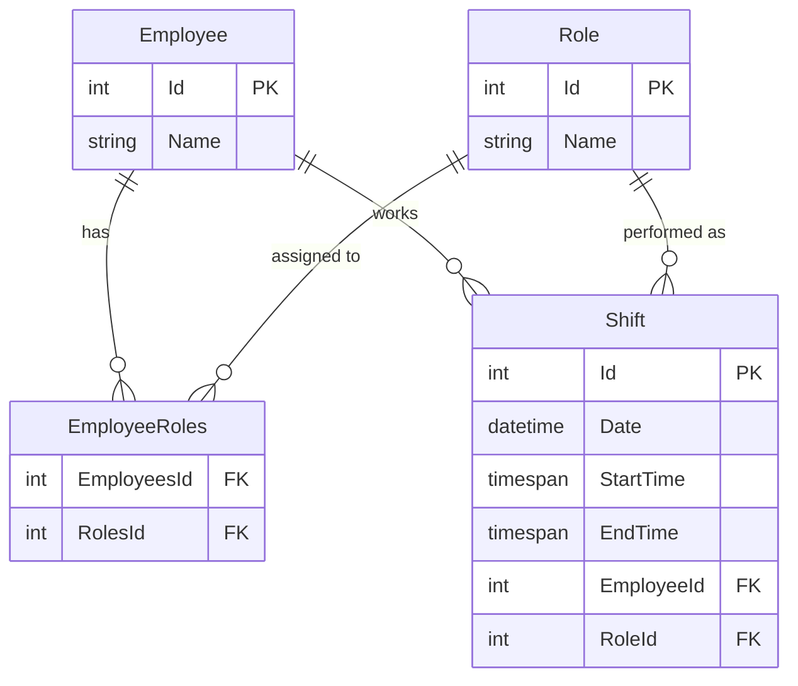

# Database Relations Diagram

```mermaid
erDiagram
    Employee {
        int Id PK
        string Name
    }

    Role {
        int Id PK
        string Name
    }

    EmployeeRoles {
        int EmployeesId FK
        int RolesId FK
    }

    Shift {
        int Id PK
        datetime Date
        timespan StartTime
        timespan EndTime
        int EmployeeId FK
        int RoleId FK
    }

    Employee ||--o{ EmployeeRoles : "has"
    Role ||--o{ EmployeeRoles : "assigned to"
    Employee ||--o{ Shift : "works"
    Role ||--o{ Shift : "performed as"
```
